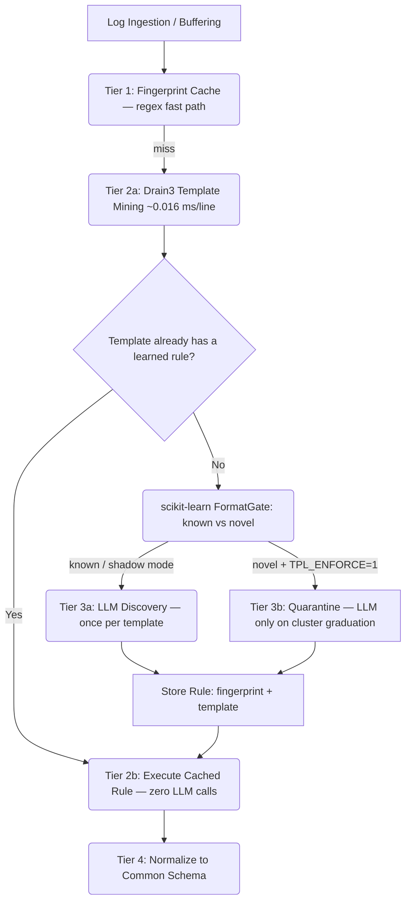

# Universal Log Pre-processing Pipeline (SIH 2026)

This project provides a robust, format-agnostic log pre-processing pipeline designed to ingest, parse, and normalize arbitrary log data streams into a unified common schema. 

Live Demo: https://sih2026-w6sr.vercel.app

## The Problem

Modern observability systems ingest logs from countless disparate sources (Syslog, JSON, CSV, pipe-delimited, unstructured prose, key=value, etc.). Manually writing and maintaining regex parsers for each new source is intractable. This project leverages an intelligent, two-tier architecture to discover formats on-the-fly and then rapidly execute the discovered rules, bridging the gap between flexibility and high throughput.

## Pipeline Architecture Diagram



By default the ML tier runs in **shadow mode** (observability only): every new template is
scored and recorded, but discovery behaves exactly as before — so there is zero regression
risk. Set `TPL_ENFORCE=1` to promote the gate to an enforcer: genuinely novel formats are
heuristically parsed and quarantined until the same cluster has been seen `TPL_GRADUATE_AFTER`
times, at which point **one** LLM call learns a rule for the entire cluster (measured: 98%
fewer LLM calls on a novel-format flood).

## Common Schema

All logs are mapped to the following normalized JSON schema:
- **`timestamp`**: UTC ISO-8601 string (e.g., `2026-09-13T10:00:00Z`), or `null`.
- **`source`**: String identifying the host, program, or origin. Defaults to `"unknown"`.
- **`event_type`**: String identifying the event category. Defaults to `"unknown"`.
- **`severity`**: Canonicalized string (`debug`, `info`, `warning`, `error`, `critical`, `unknown`).
- **`message`**: The core log message.
- **`raw`**: The original unmutated log string.
- **`extra`**: A dictionary containing all other unmapped fields or unparsed data (e.g., pid, thread, nested JSON).

## API Endpoints

- **`GET /`**: Serves the frontend UI (ingest console + Cache Inspector + Template Tier + Quarantine panels).
- **`POST /api/logs/ingest`**: Main ingestion endpoint. Accepts `{"logs": ["log1", "log2", ...]}`. Returns parsed and normalized logs. Each result includes `mode` (`Cached`/`Template-Rule`/`Quarantined`/`Discovery`/`Error`), `inferred_by` (`llm`/`heuristic`), `llm_error`, the Drain3 `template`/`cluster_id`, and the gate verdict (`gate.novel`, `gate.distance`, `gate.family_guess`).
- **`GET /api/logs/cache`**: Exposes the active Tier-1 fingerprint cache rules for inspection.
- **`GET /api/logs/templates`**: Drain3-mined templates across all traffic: cluster sizes, which clusters have rules, rule backend, and tier stats.
- **`GET /api/logs/quarantine`**: Novel templates recorded by the tier, with gate distances, family guesses, and raw samples.
- **`GET /api/health`**: Pipeline health: LLM config + template-tier stats + format-gate status + ingest-auth flag. Pass `?check_live=true` for an active connectivity test.
- **`GET /api/health/llm`**: Dedicated LLM diagnostic endpoint testing provider connection and latency.

## Technology Stack (SIH mandate → where it lives)

| Technology | Role in this project | Where |
|---|---|---|
| **Python 3.10+** | Log processing, parsing, normalization | entire backend |
| **FastAPI** | REST API + backend services | `main.py` (Pydantic v2 `LogBatch`) |
| **Drain3** | Log template extraction & pattern detection (Tier 2a) | `pipeline/template_miner.py` |
| **scikit-learn** | ML: known-family classification + unknown-format novelty gate (kNN distance on masked lines, calibrated on a foreign-host corpus — measured 100% catch of never-seen families, ~1% false alarms) | `pipeline/format_gate.py`, `models/format_gate.pkl`, trained by `scripts/train_format_gate.py` |
| **Pandas** | Data transformation & preprocessing — offline accuracy evaluation and report generation (kept out of the ingest hot path on purpose: measured parity with native Python per line, and +75 MB in the serverless bundle) | `scripts/evaluate_accuracy.py` → `docs/accuracy_report.md` |
| **Linux/Bash** | Log collection & system-level scripting | `scripts/collect.sh` (streams `/var/log/syslog`, `journalctl`, `docker logs`, `kubectl logs` into the ingest API) |
| **Docker** | Containerized deployment — optional; the primary deploy is Vercel serverless (see *Deployment* below) | — |

## Environment Variables

- `GEMINI_API_KEY`: Opt-in. If set, format discovery tries Google Gemini first (default: `gemini-3.6-flash`). `GOOGLE_API_KEY` is also accepted as an alias. Thinking is automatically set to `thinkingLevel: "low"` on Gemini 3.x. A Google HTTP 403 project-denied is treated as a permanent block for that process: Gemini is skipped and Groq/Anthropic/heuristics take over.
- `GROQ_API_KEY`: Opt-in. Free Groq Cloud key. Used when Gemini is missing or blocked (default model: `openai/gpt-oss-20b`). Recommended for the demo if Gemini returns 403. Groq's `json_object` response mode is deliberately **not** requested: gpt-oss is a reasoning model and that mode rejects its output with HTTP 400 `json_validate_failed`. Instead the pipeline parses the JSON itself, recovers the answer from `error.failed_generation` if Groq still returns a 400, and reads `message.reasoning` when `message.content` comes back empty. If none of that yields a valid rule, heuristics take over and the reason is surfaced in `llm_error`.
- `GROQ_MODEL`: Override the Groq model id (default: `openai/gpt-oss-20b`). Retired ids (`llama-3.1-8b-instant`, `llama-3.3-70b-versatile` — shut down by Groq on 2026-08-16) are auto-migrated to the default.
- `ANTHROPIC_API_KEY`: Opt-in. If set, format discovery can leverage Anthropic Claude (default: `claude-3-5-haiku-20241022`).
- `DISCOVERY_MODEL`: The Gemini model to use (default: `gemini-3.6-flash`). Supported Gemini 3.x variants: `gemini-3.6-flash`, `gemini-3.5-flash`, `gemini-3.5-flash-lite` and preview versions. Deprecated `gemini-2.5-*` values are auto-migrated to `gemini-3.6-flash` (Google removed the 2.5 family for new API keys).
- `ANTHROPIC_MODEL`: Specific Anthropic model when using Claude (default: `claude-3-5-haiku-20241022`).
- `DEMO_DISCOVERY_DELAY_MS`: Optional artificial delay for demonstration purposes (e.g., `500`).

**ML tier configuration:**
- `TPL_ENFORCE`: `1` promotes the FormatGate from shadow (observable) to enforcer (novel templates are quarantined; discovery deferred). Default: shadow mode.
- `TPL_GRADUATE_AFTER`: sightings of the same novel template before one LLM discovery call labels the whole cluster (default `8`, used only in enforce mode).
- `TPL_Q_GRADUATE_OCCURRENCES`: sightings of the same novel *line* before it escalates to discovery regardless of the graduation threshold (default `5`). Guards against cap-eviction or Drain rehashing locking a repeated novel format in quarantine forever.
- `GATE_MARGIN`: multiplier on the novelty distance threshold (default `1.0`; raise to be more permissive, lower to be stricter).
- `INGEST_API_KEY`: optional abuse guard — when set, `POST /api/logs/ingest` requires the `x-ingest-key` header. Default: open (demo mode). Prevents strangers from triggering LLM calls with crafted garbage.
- `UPSTASH_REDIS_REST_URL` / `UPSTASH_REDIS_REST_TOKEN`: optional [Vercel KV](https://vercel.com/docs/kv)-compatible store. When set, learned template rules persist there and are re-fetched on cold Starts (per template), ending the cold-start rule loss. Without them the rule map is in-memory (previous behavior).

## Supported Formats & Universal Detection

The pipeline includes built-in specialized pattern recognition and entity extraction for industry-standard log formats:
- **JSON Logs**: Standard structured JSON, Docker wrapped JSON (`{"log": "...", "stream": "..."}`), and MongoDB `$date` formats.
- **Java / Spring Boot / Log4j / Logback**: Standard Java logs with timestamp, thread, severity level, logger class hierarchy, and message.
- **Python Standard Logging**: `LEVEL:logger:message`, timestamped hyphenated logs, and bracketed filename/line logs.
- **Kubernetes / CRI / Containerd**: Container runtime streams (`stdout`/`stderr`), flags (`F`/`P`), and nested payload extraction.
- **Syslog Variants**: Both modern RFC 5424 (`<PRI>VERSION ...`) and BSD RFC 3164 formats, with priority, facility, severity, and PID.
- **Web Servers / Proxies**: NCSA Combined/Common logs (Apache & Nginx) and Nginx error logs with worker PID, connection ID, and client info.
- **Security & SIEM**: ArcSight Common Event Format (CEF) and Log Event Extended Format (LEEF) with all extension key-values parsed.
- **Logfmt / Structured Key-Value**: Unix/Go style key-value pairs (`ts=... level=... msg=...`).
- **Database Logs**: PostgreSQL query and server logs with user/database and execution duration.
- **Unstructured / Semi-Structured Prose**: Compositional zone extraction with automatic entity recognition (IPv4/IPv6, ports, users, HTTP methods/statuses, and event categories like `auth_failure`, `auth_success`, `db_query`, `connection_error`).
- **ANSI Terminal Formatting**: Automatic stripping of terminal color escape codes (`\x1b[...]`) so copy-pasted CLI logs parse flawlessly.

## Deployment

The primary deployment is **Vercel serverless** ([live demo](https://sih2026-w6sr.vercel.app)):

- Runtime deps stay lean (FastAPI + Drain3 + scikit-learn ≈ 285 MB of the 500 MB Python-function bundle budget); pandas is intentionally only in `requirements-analysis.txt`.
- The gate model ships as a build-time artifact (`models/format_gate.pkl`, ~7 MB), so cold start = one `joblib.load`, zero training, zero API keys. `vercel.json` includes `models/**` in the function bundle.
- Optional [Vercel KV / Upstash Redis](#environment-variables) gives learned template rules cross-instance persistence.

A `Dockerfile` for containerized deployment is intentionally not required; if judges want one, the app is a plain ASGI app (`uvicorn main:app --host 0.0.0.0`) and the Linux/Bash collector works against any host.

## Accuracy

Measured offline by `scripts/evaluate_accuracy.py` (pandas) → [`docs/accuracy_report.md`](docs/accuracy_report.md):

- **100.00%** known-family classification over 12 supported log families (3 000-line synthetic corpus, every field varying)
- **100%** catch of 240 lines from 4 never-seen *synthetic* format families (precision 89.2%, ~1% known-family false alarms — the calibration budget)
- Server loop: **0.28 ms/line** mean end-to-end with heuristic discovery; 99.5% of lines resolved without the discovery engine at all

**Real-world ground truth (Loghub, human-validated templates)** — `scripts/evaluate_loghub.py` → [`docs/loghub_benchmark.md`](docs/loghub_benchmark.md), with the raw samples in `data/raw/loghub/`:

- **100%** per-system family classification on 9 real systems (Linux, OpenSSH, Thunderbird, BGL, HPC, Apache, HDFS, Spark, Hadoop) on a benchmark split fully disjoint from training (gate v2 = synthetic corpus **augmented with the Loghub train split**)
- Novelty recall on 3 never-trained real systems: Windows 100%, Proxifier 100%, HealthApp 86% (**95.2% macro**); false-alarm on known systems **1.5%**
- Drain3 grouping accuracy vs official Loghub templates: **97.2% macro GA** (ICSE'19 benchmark metric) over 12 systems
- The first synthetic-only gate scored 33% on real data — the benchmark caught it, the augmentation flywheel fixed it. This loop is the MLOps story.

## Limitations

Please note the following system constraints:
- **Tier-1 cache is in-memory**: the fingerprint cache is per-instance and is lost on cold start. Template *rules* survive if Upstash/Vercel KV is configured; without it, the Drain3 tree re-mines traffic at ~0.016 ms/line, so only template-to-rule learning (LLM labels) is affected — behavior, not correctness.
- **Timezones**: Naive timestamps (timestamps without explicit timezone offsets) are assumed to be UTC.
- **Gate coverage**: the novelty gate knows the 13 families it was trained on (12 synthetic + `hpc_supercomputer` from real Loghub data); exotic but *legitimate* families may be flagged novel (review via `/api/logs/quarantine`; retrain with `scripts/train_format_gate.py`). The artifact carries `GATE_FEATURE_VERSION` — feature changes require retraining (the loader refuses stale artifacts with an actionable message).

## Running and Testing

### Setup
```bash
pip install -r requirements-dev.txt
```

### Run the pipeline locally
```bash
python run_demo.py
```
This script will start the FastAPI backend and send a representative sample of Syslog, JSON, CSV, pipe-delimited, and KV logs through the system.

### Run tests
```bash
pytest tests/ -v        # 58 tests
```

### Retrain the format gate (scikit-learn artifact)
```bash
python scripts/train_format_gate.py        # trains on synthetic corpus of 12 families,
                                           # calibrates novelty threshold on a foreign-host set,
                                           # writes models/format_gate.pkl (commit it)
```

### Evaluate accuracy (pandas → report)
```bash
pip install -r requirements-analysis.txt
python scripts/evaluate_accuracy.py        # writes docs/accuracy_report.md
```

### Ship real logs from a Linux host (Bash collector)
```bash
./scripts/collect.sh                       # tail -F /var/log/syslog -> /api/logs/ingest
SRC="journalctl -f -u sshd -o cat" ./scripts/collect.sh
SRC="docker logs -f myapp 2>&1" ./scripts/collect.sh
API=http://localhost:8000/api/logs/ingest ./scripts/collect.sh
```

### Check LLM API Status
```bash
python check_llm.py
```
This utility inspects environment variables, verifies the active provider and model, and executes an active connectivity test.
