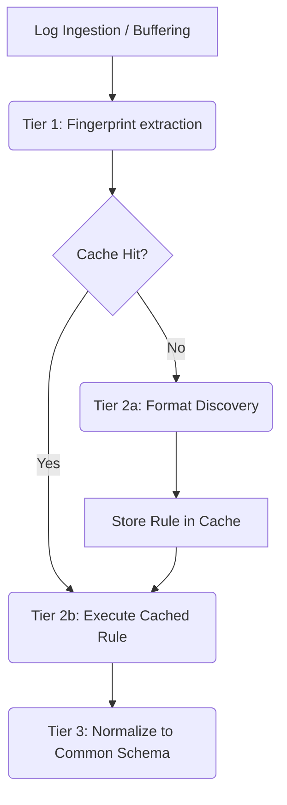

# Universal Log Pre-processing Pipeline (SIH 2026)

This project provides a robust, format-agnostic log pre-processing pipeline designed to ingest, parse, and normalize arbitrary log data streams into a unified common schema. 

Live Demo: https://sih2026-w6sr.vercel.app

## The Problem

Modern observability systems ingest logs from countless disparate sources (Syslog, JSON, CSV, pipe-delimited, unstructured prose, key=value, etc.). Manually writing and maintaining regex parsers for each new source is intractable. This project leverages an intelligent, two-tier architecture to discover formats on-the-fly and then rapidly execute the discovered rules, bridging the gap between flexibility and high throughput.

## Pipeline Architecture Diagram



## Common Schema

All logs are mapped to the following normalized JSON schema:
- **`timestamp`**: UTC ISO-8601 string (e.g., `2026-09-13T10:00:00Z`), or `null`.
- **`source`**: String identifying the host, program, or origin. Defaults to `"unknown"`.
- **`event_type`**: String identifying the event category. Defaults to `"unknown"`.
- **`severity`**: Canonicalized string (`debug`, `info`, `warning`, `error`, `critical`, `unknown`).
- **`message`**: The core log message.
- **`raw`**: The original unmutated log string.
- **`extra`**: A dictionary containing all other unmapped fields or unparsed data (e.g., pid, thread, nested JSON).

## API Endpoints

- **`GET /`**: Serves the frontend UI.
- **`POST /api/logs/ingest`**: Main ingestion endpoint. Accepts `{"logs": ["log1", "log2", ...]}`. Returns parsed and normalized logs.
- **`GET /api/logs/cache`**: Exposes the active cache rules for inspection.

## Environment Variables

- `ANTHROPIC_API_KEY`: Opt-in. If set, format discovery falls back to the Anthropic LLM API for advanced log parsing.
- `DISCOVERY_MODEL`: The Anthropic model to use (default: `claude-haiku-4-5-20251001`).
- `DEMO_DISCOVERY_DELAY_MS`: Optional artificial delay for demonstration purposes (e.g., `500`).

## Limitations

Please note the following system constraints:
- **In-Memory Cache & Serverless**: The cache is purely in-memory. Because the project is deployed on Vercel (serverless), the cache is per-instance and is lost during cold starts. Consequently, "Cached" hits and the contents of the cache inspector may vary between subsequent requests.
- **Heuristic Discovery**: Format discovery is strictly heuristic unless an `ANTHROPIC_API_KEY` is explicitly configured.
- **Timezones**: Naive timestamps (timestamps without explicit timezone offsets) are assumed to be UTC.
- **Fingerprinting**: Fingerprints rely on coarse feature counts (e.g., pipe count, comma count, token count, brackets).

## Running and Testing

### Setup
```bash
pip install -r requirements-dev.txt
```

### Run the pipeline locally
```bash
python run_demo.py
```
This script will start the FastAPI backend and send a representative sample of Syslog, JSON, CSV, pipe-delimited, and KV logs through the system.

### Run tests
```bash
pytest tests/ -v
```
