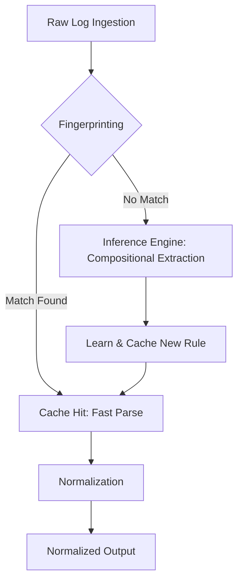

# Universal Log Pre-processing Pipeline

## Problem Statement
Log formats vary drastically across systems, ranging from structured JSON to semi-structured Syslog and completely proprietary unstructured text. Normalizing these diverse formats into a unified schema for analysis is notoriously difficult, usually requiring fragile, manually crafted regex rules for every new format encountered.

## Solution Overview
This project introduces a **Format-Agnostic Two-Tier Log Pipeline** for automatic log normalization.
It dynamically infers log structures without pre-configured rules. 
- **Tier 1 (Execution Path)** fingerprints incoming logs and attempts to match them against previously learned structures.
- **Tier 2 (Discovery Path)** kicks in for novel formats, running an inference engine to extract compositional zones (timestamps, severities, context, key-value pairs) and learning a new parsing rule on the fly.
- **Tier 3 (Normalization)** standardizes the extracted data into a common schema.

## Architecture



## Tech Stack
- **Backend:** Python, FastAPI, Pydantic, Python-Dateutil
- **Frontend:** Vanilla JS, HTML5, CSS3
- **Deployment:** Vercel (Serverless Python)

## Setup and Run Instructions

### Local Environment
1. **Clone the repository.**
2. **Install dependencies:**
   ```bash
   pip install -r requirements.txt
   ```
3. **Run the demo script** (which spins up the server and sends test payloads):
   ```bash
   python run_demo.py
   ```
4. **Or run the web app manually:**
   ```bash
   uvicorn main:app --reload
   ```
   Navigate to `http://localhost:8000` to interact with the UI.

### Live Demo
**Link:** [https://sih2026-w6sr.vercel.app](https://sih2026-w6sr.vercel.app)

## Environment Variables
*(No mandatory environment variables are required to run the current logic locally. Any required keys should be placed in `.env.local` according to `.gitignore`)*

## Project Structure
- `main.py` - FastAPI entry point, exposing ingestion API and serving the frontend.
- `run_demo.py` - CLI script that starts the server and sends sample logs for testing.
- `pipeline/`
  - `format_detector.py` - The "LLMDiscoveryEngine" fallback for unknown structures.
  - `parser.py` - Core logic for caching, fingerprinting, and structural extraction.
  - `normalizer.py` - Formats parsed results into a standardized schema.
- `static/`
  - `index.html`, `app.js`, `styles.css` - Interactive frontend application.
- `requirements.txt` - Python dependencies.
- `vercel.json` - Vercel deployment configuration.
