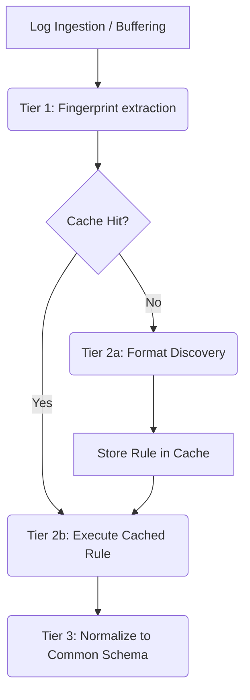

# Universal Log Pre-processing Pipeline (SIH 2026)

This project provides a robust, format-agnostic log pre-processing pipeline designed to ingest, parse, and normalize arbitrary log data streams into a unified common schema. 

Live Demo: https://sih2026-w6sr.vercel.app

## The Problem

Modern observability systems ingest logs from countless disparate sources (Syslog, JSON, CSV, pipe-delimited, unstructured prose, key=value, etc.). Manually writing and maintaining regex parsers for each new source is intractable. This project leverages an intelligent, two-tier architecture to discover formats on-the-fly and then rapidly execute the discovered rules, bridging the gap between flexibility and high throughput.

## Pipeline Architecture Diagram



## Common Schema

All logs are mapped to the following normalized JSON schema:
- **`timestamp`**: UTC ISO-8601 string (e.g., `2026-09-13T10:00:00Z`), or `null`.
- **`source`**: String identifying the host, program, or origin. Defaults to `"unknown"`.
- **`event_type`**: String identifying the event category. Defaults to `"unknown"`.
- **`severity`**: Canonicalized string (`debug`, `info`, `warning`, `error`, `critical`, `unknown`).
- **`message`**: The core log message.
- **`raw`**: The original unmutated log string.
- **`extra`**: A dictionary containing all other unmapped fields or unparsed data (e.g., pid, thread, nested JSON).

## API Endpoints

- **`GET /`**: Serves the frontend UI.
- **`POST /api/logs/ingest`**: Main ingestion endpoint. Accepts `{"logs": ["log1", "log2", ...]}`. Returns parsed and normalized logs. Each result includes `mode` (`Cached`/`Discovery`), `inferred_by` (`llm`/`heuristic`), and `llm_error` — the verdict shown on a heuristic fallback, e.g. a missing API key or the provider's HTTP error, so LLM failures are never silent.
- **`GET /api/logs/cache`**: Exposes the active cache rules for inspection.

## Environment Variables

- `GEMINI_API_KEY`: Opt-in. If set, format discovery can leverage Google Gemini for format discovery.
- `ANTHROPIC_API_KEY`: Opt-in. If set, format discovery falls back to the Anthropic LLM API for format discovery.
- `DISCOVERY_MODEL`: The LLM model to use (default: `gemini-3.6-flash` or `claude-haiku-4-5-20251001`).
- `DEMO_DISCOVERY_DELAY_MS`: Optional artificial delay for demonstration purposes (e.g., `500`).

## Supported Formats & Universal Detection

The pipeline includes built-in specialized pattern recognition and entity extraction for industry-standard log formats:
- **JSON Logs**: Standard structured JSON, Docker wrapped JSON (`{"log": "...", "stream": "..."}`), and MongoDB `$date` formats.
- **Java / Spring Boot / Log4j / Logback**: Standard Java logs with timestamp, thread, severity level, logger class hierarchy, and message.
- **Python Standard Logging**: `LEVEL:logger:message`, timestamped hyphenated logs, and bracketed filename/line logs.
- **Kubernetes / CRI / Containerd**: Container runtime streams (`stdout`/`stderr`), flags (`F`/`P`), and nested payload extraction.
- **Syslog Variants**: Both modern RFC 5424 (`<PRI>VERSION ...`) and BSD RFC 3164 formats, with priority, facility, severity, and PID.
- **Web Servers / Proxies**: NCSA Combined/Common logs (Apache & Nginx) and Nginx error logs with worker PID, connection ID, and client info.
- **Security & SIEM**: ArcSight Common Event Format (CEF) and Log Event Extended Format (LEEF) with all extension key-values parsed.
- **Logfmt / Structured Key-Value**: Unix/Go style key-value pairs (`ts=... level=... msg=...`).
- **Database Logs**: PostgreSQL query and server logs with user/database and execution duration.
- **Unstructured / Semi-Structured Prose**: Compositional zone extraction with automatic entity recognition (IPv4/IPv6, ports, users, HTTP methods/statuses, and event categories like `auth_failure`, `auth_success`, `db_query`, `connection_error`).
- **ANSI Terminal Formatting**: Automatic stripping of terminal color escape codes (`\x1b[...]`) so copy-pasted CLI logs parse flawlessly.

## Limitations

Please note the following system constraints:
- **In-Memory Cache & Serverless**: The cache is purely in-memory. Because the project is deployed on Vercel (serverless), the cache is per-instance and is lost during cold starts. Consequently, "Cached" hits and the contents of the cache inspector may vary between subsequent requests.
- **Timezones**: Naive timestamps (timestamps without explicit timezone offsets) are assumed to be UTC.

## Running and Testing

### Setup
```bash
pip install -r requirements-dev.txt
```

### Run the pipeline locally
```bash
python run_demo.py
```
This script will start the FastAPI backend and send a representative sample of Syslog, JSON, CSV, pipe-delimited, and KV logs through the system.

### Run tests
```bash
pytest tests/ -v
```
